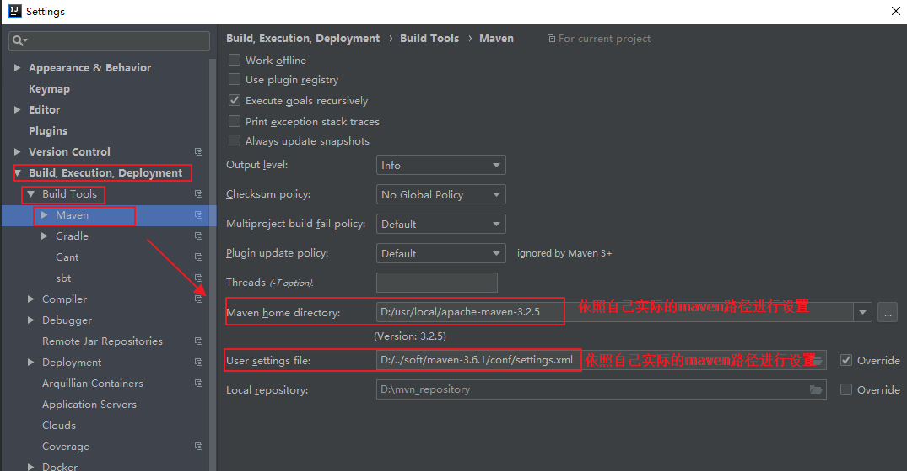
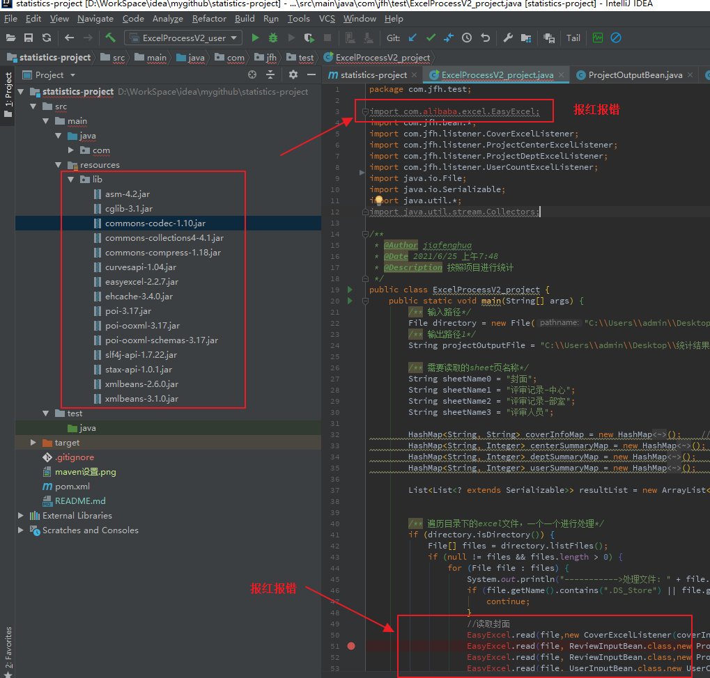
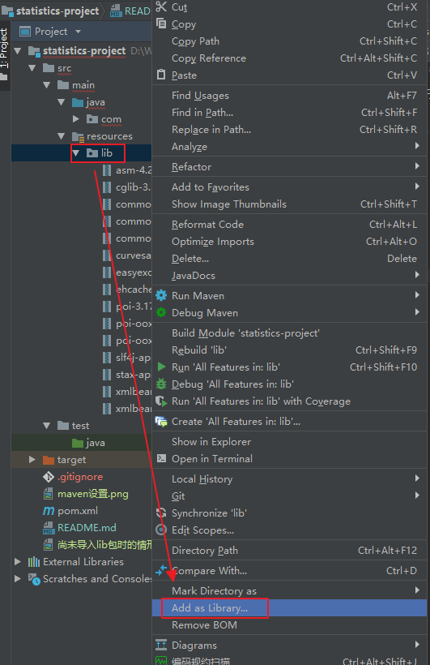
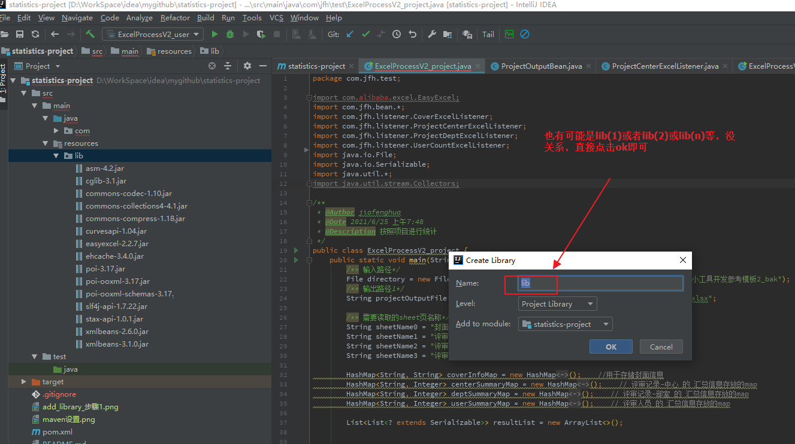
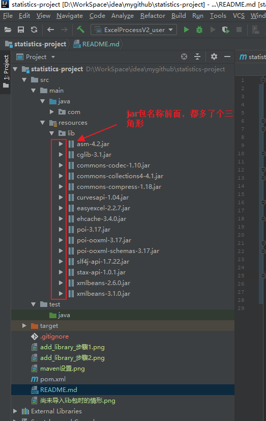

# statistics-project
  
基于各部门评审意见的统计汇总  

## 导入项目的步骤
1、在idea工具中，选中File-->open，接着选中项目的根目录，如此，将项目导入到idea中  

2、设置项目的maven：
    1）选中File-->Settings，打开设置，并如下图所示设置maven  
    

3、第一次导入项目时，由于resources目录下的lib下的jar包都还没有被添加到【当前项目的环境中】，因此此时代码会报如下的错误（下面的错误这是个示例）  
    
    
     
   接下来，我们需要把resources目录下的jar包，添加到当前项目的环境中来  
    操作如下：在lib目录上，点击右键，然后选中Add As Library，如下图  
    
    
        
   紧接着操作如下：    
    

  
   jar被加入到项目环境中之后，可以看到如下图，jar包前面的图标也发生了变化（不同的idea版本，变化可能不一样……）    
     

   
   至此，一般来说项目就已经被成功导入到idea中，并且可以运行了。

